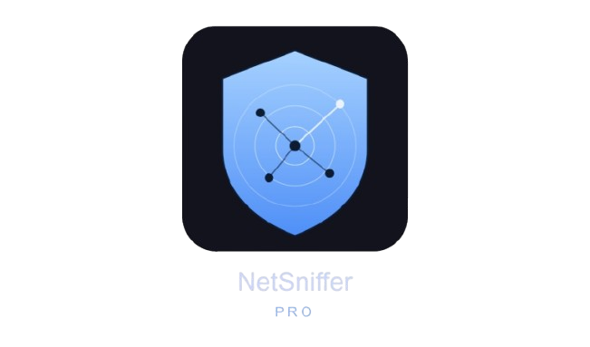
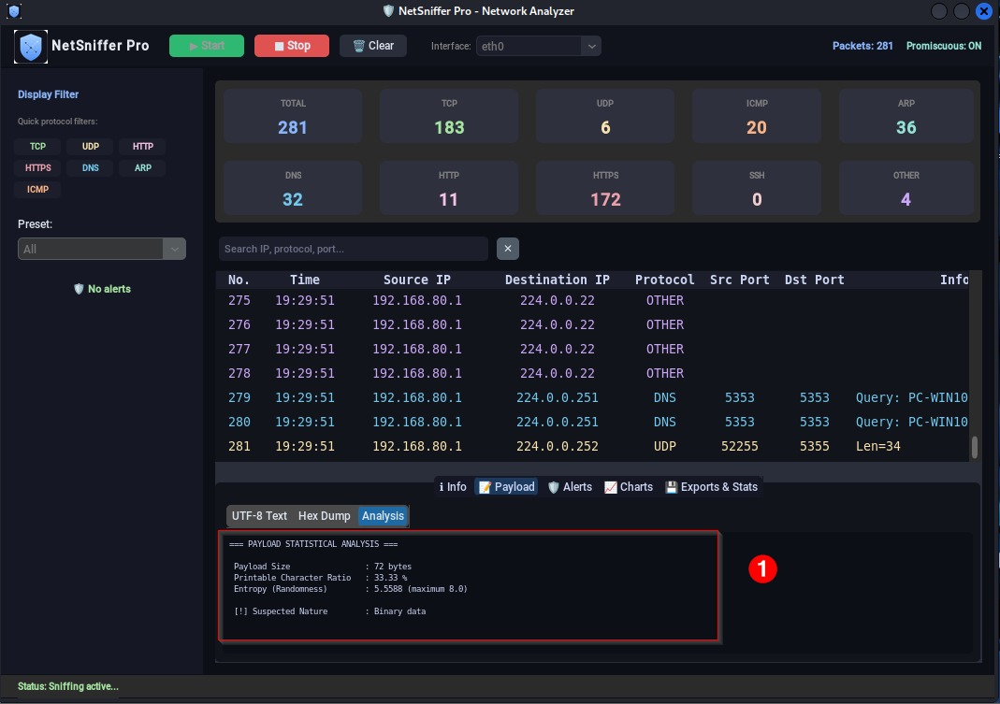
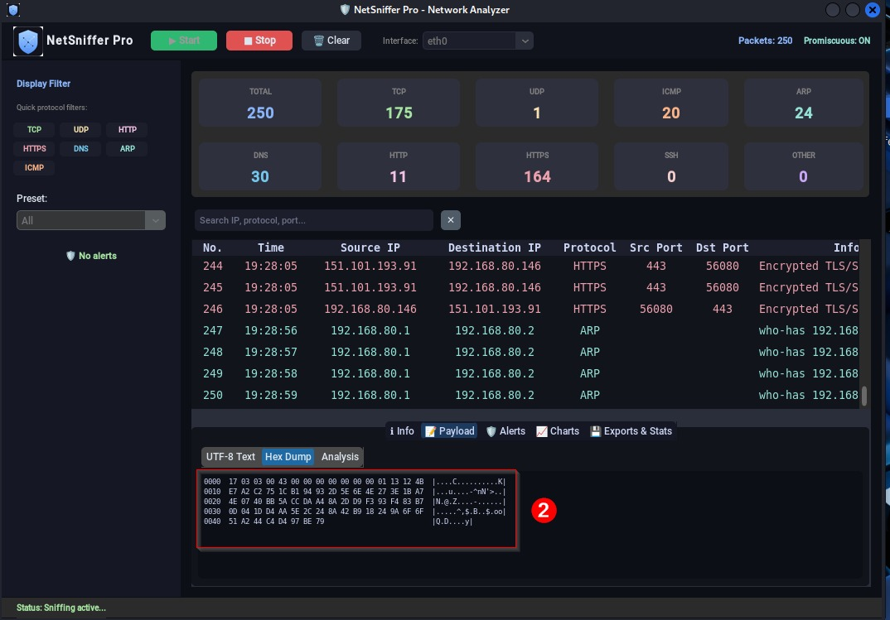
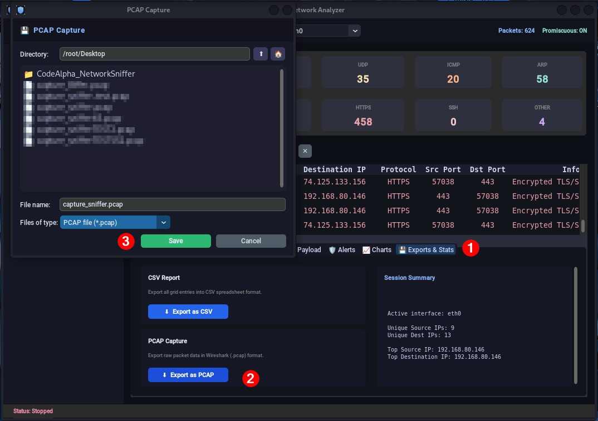

<p align="center">
  
</p>

<h1 align="center">NetSniffer Pro</h1>
<p align="center"><b>V3.0 — Modern Network Analyzer</b></p>

<p align="center">
  
  
  
  
</p>

<p align="center">
  A dark-themed network packet sniffer with real-time capture, protocol analysis, and export capabilities —
  available as both a desktop GUI and a terminal CLI, sharing one core engine.
</p>

<p align="center">
  <a href="#-features">Features</a> •
  <a href="#-installation">Installation</a> •
  <a href="#-usage">Usage</a> •
  <a href="#-screenshots">Screenshots</a> •
  <a href="#-license">License</a>
</p>

---


## 📋 Table of Contents

- [Features](#-features)
- [Architecture](#-architecture)
- [Requirements](#-requirements)
- [Installation](#-installation)
- [Usage](#-usage)
- [Supported Protocols](#-supported-protocols)
- [Export Options](#-export-options)
- [Screenshots](#-screenshots)
- [Project Structure](#-project-structure)
- [Running Without Sudo](#-running-without-sudo)
- [Contributing](#-contributing)
- [License](#-license)
- [Author](#-author)

---

## ✨ Features

| Feature | Description |
|---------|-------------|
| 🎨 **Modern GUI** | Dark/Light themes with CustomTkinter, resizable packet/detail panes |
| 🖥️ **CLI frontend** | Same capture engine, colorized live terminal output (via `rich`) |
| 📡 **Real-Time Capture** | Live packet sniffing with instant table/terminal updates |
| 🔍 **Live Search** | Filter captured packets in real-time by IP, port, or protocol |
| 📊 **Stats Dashboard** | Color-coded stat cards showing protocol distribution at a glance |
| 🔎 **Deep Inspection** | Detailed packet info, hex dump, and payload entropy analysis |
| 🕵️ **Heuristic Alerts** | Basic port-scan and ARP-spoofing detection (educational, not IDS-grade) |
| 💾 **CSV Export** | Export all captured data to spreadsheet-friendly CSV |
| 📦 **PCAP Export** | Save raw packets in Wireshark-compatible `.pcap` format |
| 🌐 **Multi-Protocol** | Detects TCP, UDP, ICMP, ARP, DNS, HTTP, HTTPS/TLS, and SSH traffic |
| 🔓 **No-sudo deployment** | Package with PyInstaller + `setcap` instead of running as root |
| 🖥️ **Cross-Platform** | Works on Linux (Kali), macOS, and Windows |

---

## 🏗️ Architecture

The GUI and CLI are two thin frontends around one shared, Tkinter-free
core — neither one contains its own capture or classification logic, so
they can never drift out of sync with each other.

```
┌─────────────────────────────────────────────────────────────┐
│                        FRONTENDS                              │
│   ui/app.py  (CustomTkinter GUI)     cli.py  (terminal CLI)   │
└───────────────────────┬─────────────────────┬─────────────────┘
                         └──────────┬──────────┘
                                    ▼
┌─────────────────────────────────────────────────────────────┐
│                    SHARED CORE (no GUI deps)                  │
│                                                                 │
│  capture/sniffer.py     PacketCapture (scapy AsyncSniffer)     │
│  capture/classifier.py  protocol classification                │
│  capture/alerts.py      heuristic mini-IDS                     │
│  analysis/payload.py    hex dump, UTF-8 decode, entropy        │
│  analysis/traffic_rate.py  packets/sec history                 │
│  export/exporters.py    CSV / PCAP export                       │
│  models.py / config.py  shared data structures & constants      │
└─────────────────────────────────────────────────────────────┘
                                    │
                                    ▼
                            scapy / raw sockets
```

---

## 📦 Requirements

- **Python** 3.10 or higher
- **Operating System**: Linux (Kali recommended), macOS, or Windows
- **Privileges**: Administrator / root access required for raw packet capture (or a `setcap`'d binary — see below)

### Python Dependencies

| Package | Purpose |
|---------|---------|
| `scapy` | Packet capture & dissection engine |
| `customtkinter` | Modern themed GUI widgets |
| `matplotlib` | Real-time traffic charts (GUI) |
| `pillow` | Icon/logo handling |
| `rich` *(optional)* | Colorized live output for the CLI |
| `pyfiglet` *(optional)* | ASCII-art title in the CLI welcome banner |

---

## 🚀 Installation

```bash
git clone https://github.com/cybertechsali/netsniffer-pro.git
cd netsniffer-pro
pip install -r requirements.txt
```

---

## ▶️ Usage

### GUI

```bash
sudo python3 main.py          # Linux/macOS
python main.py                 # Windows, run as Administrator
```

### CLI

```bash
sudo python3 main_cli.py --list-interfaces
sudo python3 main_cli.py -i eth0
sudo python3 main_cli.py -i eth0 -f "https/tls (port 443)"
sudo python3 main_cli.py -i eth0 -d 30 -o capture.pcap
sudo python3 main_cli.py --about      # full feature list
sudo python3 main_cli.py --help       # all options
```

> ⚠️ **Root/Admin privileges are required** because raw socket access is needed for packet capture — unless you use the `setcap` workflow below.

---

## 🌐 Supported Protocols

| Protocol | Detection Method | Info Displayed |
|----------|-----------------|----------------|
| **TCP** | IP + TCP layer | Flags (SYN, ACK, FIN, RST...) |
| **UDP** | IP + UDP layer | Payload length |
| **ICMP** | IP + ICMP layer | Type & Code |
| **ARP** | ARP layer | who-has / is-at operations |
| **DNS** | UDP port 53 | Query/Response + domain name |
| **HTTP** | TCP port 80 | First line of HTTP request/response |
| **HTTPS/TLS** | TCP port 443 | TLS SNI (target hostname) when present |
| **SSH** | TCP port 22 | Protocol banner |

---

## 💾 Export Options

| Format | Extension | Use Case |
|--------|-----------|----------|
| **CSV** | `.csv` | Spreadsheet analysis, reporting |
| **PCAP** | `.pcap` | Open in Wireshark for deep analysis |

---

## 📸 Screenshots

<table>
<tr>
<td width="50%">

**GUI — Main Dashboard & Live Charts**<br>
Real-time stats cards, live packet table, packets/sec and protocol distribution charts.


</td>
<td width="50%">

**Payload — Statistical Analysis**<br>
Payload size, printable-character ratio, Shannon entropy, and suspected nature.



</td>
</tr>
<tr>
<td width="50%">

**Payload — Hex Dump**<br>
Raw bytes of the selected packet, offset + hex + ASCII columns.



</td>
<td width="50%">

**Export — CSV & PCAP**<br>
One-click export to CSV or Wireshark-compatible PCAP, with a live session summary.



</td>
</tr>
<tr>
<td width="50%">

**Export — Success Confirmation**<br>
Themed confirmation dialog once the export completes.


</td>
<td width="50%">

**CLI — Welcome Banner**<br>
Centered, boxed welcome screen shown once at startup: name, author, version, engine.


</td>
</tr>
<tr>
<td colspan="2">

**CLI — Live Capture & Session Summary**<br>
Same capture engine as the GUI, rendered in the terminal: live packet feed, then a per-protocol count summary on exit (Ctrl+C).


</td>
</tr>
</table>
---

## 📁 Project Structure

```
netsniffer-pro/
├── main.py                    # GUI entry point
├── main_cli.py                 # CLI entry point
├── netsniffer.spec              # PyInstaller build config (GUI)
├── netsniffer_cli.spec          # PyInstaller build config (CLI)
├── requirements.txt
├── pyproject.toml
├── LICENSE
├── README.md
│
├── netsniffer/
│   ├── config.py                # centralized constants & app metadata
│   ├── models.py                 # shared dataclasses
│   ├── cli.py                    # CLI frontend
│   ├── assets/                   # icon.png / icon.ico
│   │
│   ├── capture/
│   │   ├── sniffer.py             # PacketCapture (scapy wrapper)
│   │   ├── classifier.py          # protocol classification
│   │   └── alerts.py              # heuristic mini-IDS
│   │
│   ├── analysis/
│   │   ├── payload.py             # hex dump / entropy / UTF-8
│   │   └── traffic_rate.py        # packets/sec tracker
│   │
│   ├── export/
│   │   └── exporters.py           # CSV / PCAP export
│   │
│   └── ui/                        # GUI frontend (only Tkinter-dependent part)
│       ├── app.py
│       └── save_dialog.py
│
├── scripts/
│   ├── build_linux.sh             # PyInstaller build + setcap
│   └── setcap_linux.sh            # grant raw-socket capability
│
└── tests/
    ├── test_classifier.py
    ├── test_alerts.py
    ├── test_payload.py
    └── test_traffic_rate.py
```

---

## 🔓 Running Without Sudo

```bash
pyinstaller netsniffer.spec          # or netsniffer_cli.spec for the CLI
sudo ./scripts/setcap_linux.sh dist/netsniffer
dist/netsniffer -i eth0              # no sudo needed after this
```

`setcap` grants only `cap_net_raw`/`cap_net_admin` on the binary file —
strictly narrower than running the whole app as root.

---

## 🤝 Contributing

1. **Fork** the repository
2. **Create** a feature branch: `git checkout -b feature/my-feature`
3. **Commit** your changes: `git commit -m "Add my feature"`
4. **Push** to the branch: `git push origin feature/my-feature`
5. **Open** a Pull Request

Please keep the core/frontend separation intact — any new capture,
classification, or export logic should stay testable without Tkinter.

---

## 📄 License

This project is licensed under the **MIT License** — see the [LICENSE](LICENSE) file for details.

---

## 👤 Author

**Ouchahed Salma** — [@cybertechsali](https://github.com/cybertechsali)

**CodeAlpha Cybersecurity Internship — Task 1**

> Built with Python, Scapy & CustomTkinter

---

<p align="center">
  <b>⭐ Star this repo if you found it useful!</b>
</p>
